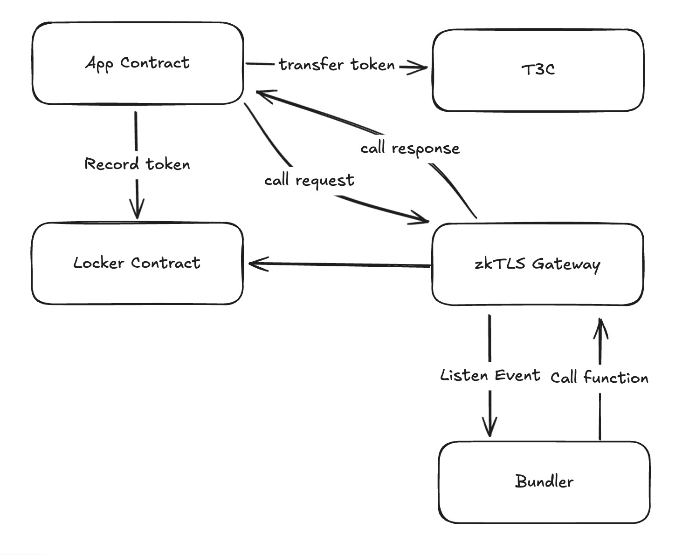
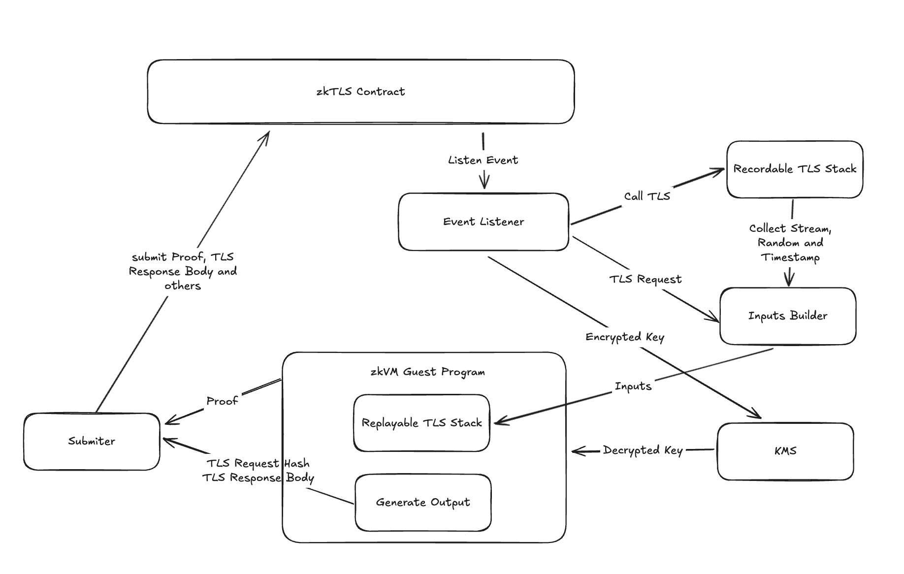
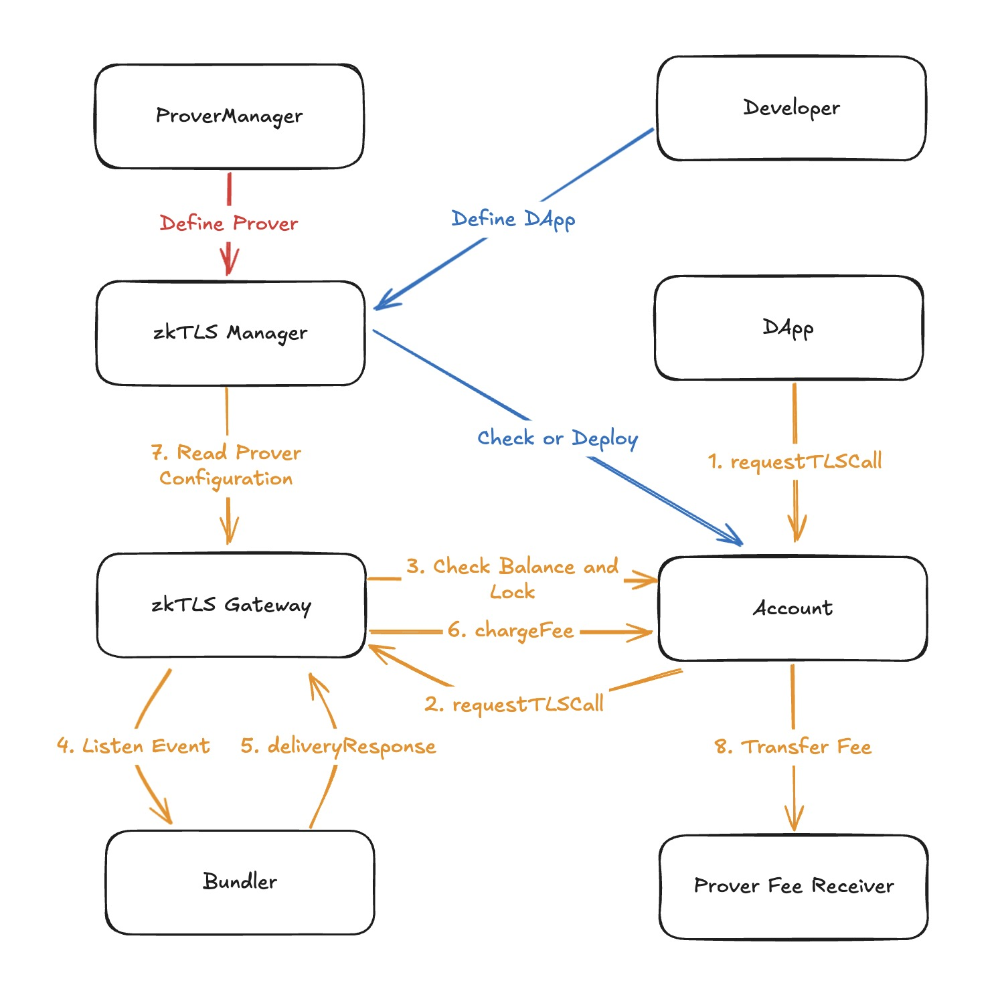
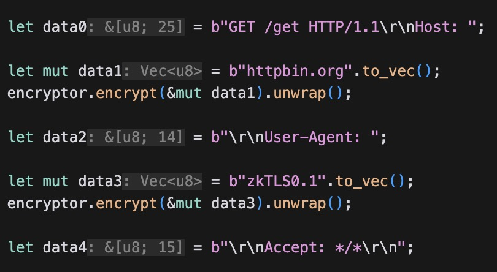
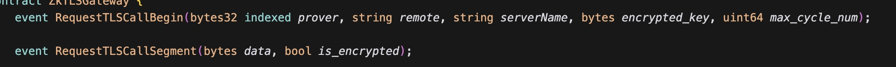
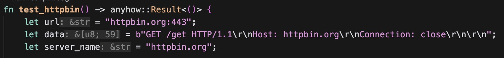

# Contracts for zkTLS

## Design Architecture

## ZKTLS Contracts Specification

### ZkTlsManager

* register and deployer account contracts 
* manage zktls configuration

### ZkTlsGateway

* process zktls call and emit zktls events
* charge zktls fee
* delivery response vis callback

### The3CloudAccount

* allow dApp to register account
* deposit payment token and gas
* initialize zktls request

## Interfaces

## References

- https://github.com/risc0/risc0-foundry-template/
- https://datatracker.ietf.org/doc/html/rfc2616
- https://http.dev/1.1
- https://github.com/the3cloud/zktls